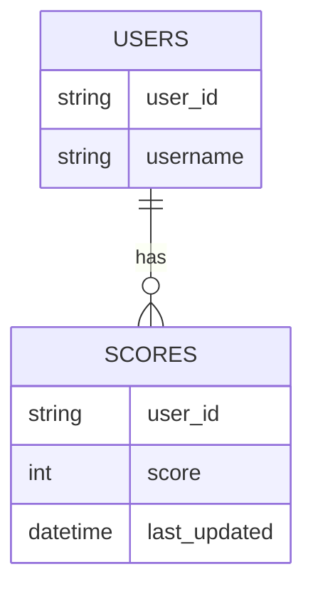
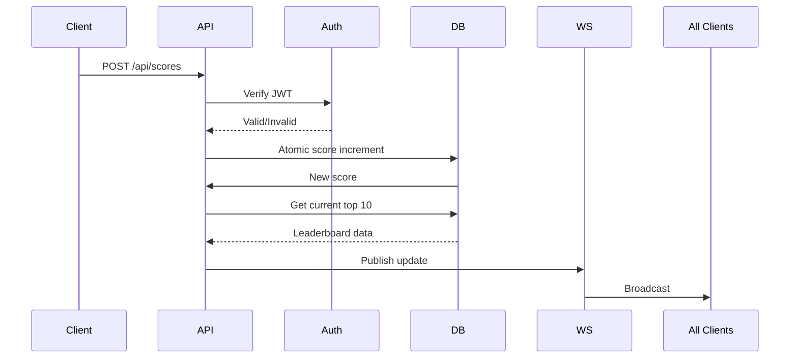

# Scoreboard API Service

## Overview
Backend service for real-time scoreboard management. Provides API endpoints for score updates and live top-10 rankings.

## Features
- Secure score submission
- Real-time leaderboard updates
- Top 10 ranking retrieval
- Malicious activity prevention

## API Endpoints

### 1. POST `/api/scores`
**Request:**
```json
{
  "score_increment": 50
}
```
**Headers:**
```
Authorization: Bearer <JWT_TOKEN>
```

**Responses:**
- 200: Score updated
- 401: Unauthorized
- 429: Too many requests

### 2. GET `/api/leaderboard`
**Response:**
```json
{
  "scores": [
    {"username": "Player1", "score": 1500},
    {"username": "Player2", "score": 1200}
  ]
}
```

## Real-Time Updates
WebSocket endpoint `ws://<host>/updates` pushes leaderboard changes:
```json
{
  "type": "leaderboard_update",
  "data": [...] 
}
```

## Database Design


## Security
1. JWT Authentication
2. Rate limiting (10 req/min per user)
3. Input validation:
   - Positive integers only
   - Max 1000 points/request

## Execution Flow


## Improvements
1. **Caching:** Add Redis cache for leaderboard
2. **Monitoring:** Implement Prometheus metrics
3. **Fraud Detection:** Add anomaly detection system
4. **Database Optimization:** Sharding for scale
5. **Versioning:** API version support
6. **Testing:** Load testing scenarios
7. **Documentation:** Swagger/OpenAPI spec

## Implementation Notes
1. Use Redis sorted sets for O(1) leaderboard updates
2. WebSocket connection pooling for >10k concurrent users
3. Rate limiting via token bucket algorithm
4. Unit test coverage:
   - Authentication failure
   - Score boundary conditions
   - Concurrent updates
